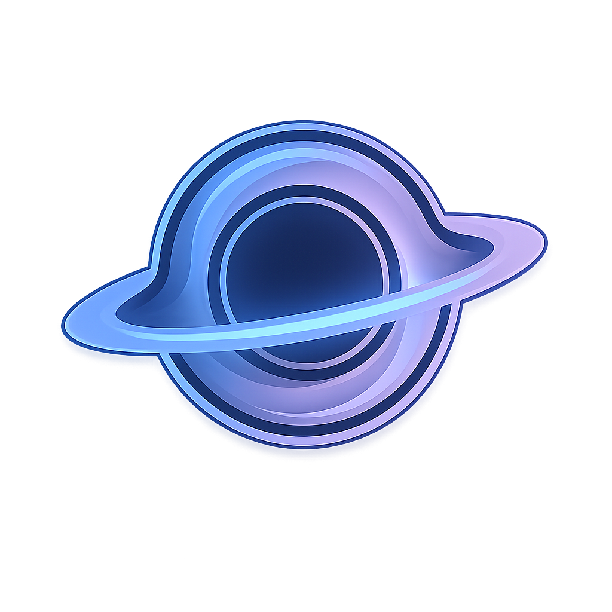

<div align="center">
  
  <h1>ORBIT</h1>
  <p><strong>Optimized Rendering for Black-hole Interactive Telemetry</strong></p>
  <p><i>Simulação interativa de buraco negro (métrica de Kerr aproximada) com renderização GPU em tempo real via WebGL2 + Worker</i></p>

  <p>
    
    
    
    
    <a href="LICENSE"></a>
  </p>
</div>

---

## Documentação

Documentação principal do projeto na raiz:

- [README](README.md)
- [Roadmap](ROADMAP.md)
- [Contribuição](CONTRIBUTING.md)
- [Código de Conduta](CODE_OF_CONDUCT.md)
- [Segurança](SECURITY.md)
- [Suporte](SUPPORT.md)
- [Histórico de Mudanças](CHANGELOG.md)
- [Licença](LICENSE)

---

## Visão Geral

O **Event Horizon Engine** é uma aplicação front-end focada em visualização física/estética de um buraco negro com:

- raymarching em fragment shader;
- renderização desacoplada da UI usando `OffscreenCanvas` em `Web Worker`;
- controle interativo de massa e spin;
- telemetria visual derivada dos parâmetros do modelo;
- ajuste automático de qualidade e resolução interna para perseguir `60 FPS`.

---

## Funcionalidades

- Renderização em GPU com `WebGL2`.
- Pipeline de simulação no `Worker` (evita bloquear a main thread do React).
- Controle de câmera orbital via pointer drag.
- Ajuste de qualidade manual por interação (`UPDATE_QUALITY`) + ajuste adaptativo automático.
- Controle adaptativo de performance baseado em EWMA de frame time:
  - reduz resolução interna e/ou qualidade quando o frame time sobe;
  - recupera qualidade e resolução gradualmente quando há folga de GPU.
- Painel de parâmetros e telemetria (horizonte de eventos, ergosfera e velocidade angular aproximada).

---

## Arquitetura

Fluxo principal:

1. `src/components/BlackHoleEngine.tsx` cria o canvas, transfere para `OffscreenCanvas` e inicializa o worker.
2. `src/workers/blackhole.worker.ts` compila shaders e executa o loop de render.
3. A UI envia mensagens (`INIT`, `UPDATE_PARAMS`, `UPDATE_CAMERA`, `UPDATE_QUALITY`, `RESIZE`, `STOP`) para o worker.
4. O worker atualiza uniforms e desenha um quad fullscreen com raymarching no fragment shader.

---

## Performance

Estratégia atual:

- alvo de `60 FPS` (`16.67ms` por frame);
- medição de frame time suavizada por EWMA;
- ajuste periódico de:
  - `renderScale` (`0.5` até `1.0`);
  - `u_quality` (`0.2` até `1.0`).

Observação importante:

- em aplicações WebGL, 60 FPS constante absoluto depende de hardware, navegador, carga do sistema e resolução da tela.  
- este projeto implementa um controle de adaptação para manter o frame time o mais próximo possível da meta.

---

## Stack Técnica

- React 19
- TypeScript
- Vite 6
- Tailwind CSS 4
- WebGL2
- Web Workers + OffscreenCanvas

---

## Estrutura do Projeto

```text
.
├── src/
│   ├── components/
│   │   └── BlackHoleEngine.tsx
│   ├── workers/
│   │   └── blackhole.worker.ts
│   ├── App.tsx
│   ├── main.tsx
│   └── index.css
├── index.html
├── metadata.json
├── package.json
├── tsconfig.json
├── vite.config.ts
├── README.md
├── ROADMAP.md
├── CONTRIBUTING.md
├── CODE_OF_CONDUCT.md
├── SECURITY.md
├── SUPPORT.md
├── CHANGELOG.md
└── LICENSE
```

---

## Como Executar

### Pré-requisitos

- Node.js 20+
- npm 10+

### Ambiente local

```bash
npm install
npm run dev
```

Acesso local padrão:

- `http://localhost:3000`

### Build de produção

```bash
npm run build
npm run preview
```

### Qualidade de código

```bash
npm run lint
```

---

## Variáveis de Ambiente

Arquivo de referência: `.env.example`.

Variáveis existentes:

- `GEMINI_API_KEY`: disponível no template atual (não é requisito para a simulação WebGL em si).
- `APP_URL`: URL da aplicação quando hospedada.

---

## Licença

Projeto open source sob a **MIT License**.  
Consulte [LICENSE](LICENSE).

---

## Contribuição

Contribuições são bem-vindas.

Antes de abrir PR, leia:

- [CONTRIBUTING.md](CONTRIBUTING.md)
- [CODE_OF_CONDUCT.md](CODE_OF_CONDUCT.md)
- [SECURITY.md](SECURITY.md)

<div align="center">
  Construído para visualização interativa, performance previsível e evolução incremental.
</div>
